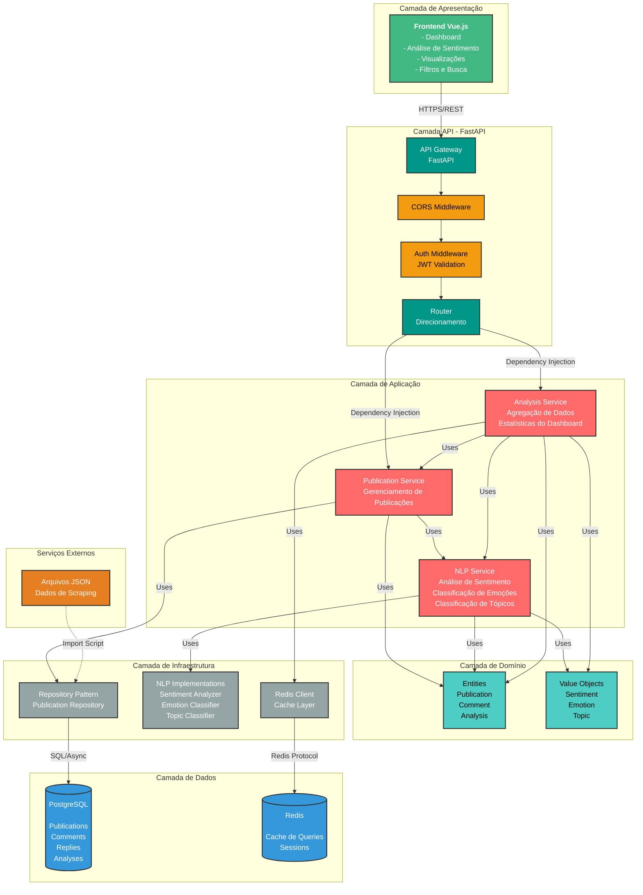

# Arquitetura do Sistema

## Visão Geral

Este documento descreve a arquitetura do backend de análise de sentimento e tópicos em publicações de redes sociais, implementada seguindo os princípios de **Clean Architecture** e **Hexagonal Architecture**.

## Diagrama de Arquitetura



## Camadas da Arquitetura

### 1. Camada de Apresentação (Frontend)
- **Tecnologia:** Vue.js 3 + TypeScript
- **Responsabilidades:**
  - Interface de usuário
  - Visualizações e gráficos (Chart.js)
  - Filtros e buscas
  - Gerenciamento de estado (Pinia)

### 2. Camada API (FastAPI)
- **Tecnologia:** FastAPI
- **Componentes:**
  - **API Gateway:** Ponto de entrada único
  - **CORS Middleware:** Controle de acesso cross-origin
  - **Auth Middleware:** Validação JWT (futuro)
  - **Router:** Direcionamento de requisições
- **Responsabilidades:**
  - Receber requisições HTTP
  - Validação de entrada (Pydantic)
  - Serialização de saída
  - Tratamento de erros

### 3. Camada de Aplicação
- **Services:**
  - **PublicationService:** Gerenciamento de publicações (CRUD)
  - **NLPService:** Orquestração de análises NLP
  - **AnalysisService:** Agregação e estatísticas
- **Responsabilidades:**
  - Lógica de negócio
  - Orquestração de operações
  - Coordenação entre camadas

### 4. Camada de Domínio
- **Entities:**
  - `Publication`: Publicação com comentários
  - `Comment`: Comentário com respostas
  - `AnalyzedPublication`: Publicação analisada
  - `DashboardStats`: Estatísticas agregadas
- **Value Objects:**
  - `Sentiment`: Positivo, Negativo, Neutro
  - `Emotion`: Alegria, Raiva, Frustração, Ansiedade
  - `Topic`: Ameaças, Rivalidade, Segurança, etc.
- **Responsabilidades:**
  - Regras de negócio puras
  - Entidades imutáveis
  - Sem dependências externas

### 5. Camada de Infraestrutura
- **Database:**
  - Repository Pattern
  - SQLAlchemy Models
  - Queries otimizadas
- **NLP:**
  - Classificadores baseados em keywords
  - Extensível para modelos ML
- **Cache:**
  - Cliente Redis
  - Cache de queries frequentes
- **Responsabilidades:**
  - Implementações técnicas
  - Acesso a dados
  - Integrações externas

### 6. Camada de Dados
- **PostgreSQL:**
  - Armazenamento persistente
  - Relacionamentos complexos
  - Índices para performance
- **Redis:**
  - Cache de queries
  - Sessões (futuro)
  - Filas (futuro com Celery)

## Fluxo de Dados

```
Frontend (Vue.js)
    ↓ HTTP Request
API Layer (FastAPI Routes)
    ↓ Dependency Injection
Application Services
    ↓ Uses
Domain Entities/Value Objects
    ↓ Uses
Infrastructure (Repositories)
    ↓ SQL/Async
Database (PostgreSQL)
```

## Princípios Aplicados

### SOLID
- **Single Responsibility:** Cada classe tem uma responsabilidade única
- **Dependency Inversion:** Dependências apontam para abstrações (Domain)

### Clean Architecture
- **Independência de Frameworks:** Domain não depende de FastAPI/SQLAlchemy
- **Testabilidade:** Camadas isoladas facilitam testes
- **Independência de UI:** API pode ser trocada sem afetar Domain
- **Independência de Banco:** Repository Pattern permite trocar banco

### Padrões de Projeto
- **Repository Pattern:** Abstração de acesso a dados
- **Service Layer:** Lógica de negócio isolada
- **DTO Pattern:** Pydantic schemas para entrada/saída
- **Dependency Injection:** Via FastAPI Depends

## Tecnologias

| Camada | Tecnologia | Versão |
|--------|-----------|--------|
| API | FastAPI | >=0.115.0 |
| ORM | SQLAlchemy | >=2.0.0 (async) |
| Banco | PostgreSQL | 14+ |
| Cache | Redis | 7+ |
| Validação | Pydantic | >=2.9.0 |
| Migrations | Alembic | >=1.13.0 |
| NLP | spaCy | >=3.7.0 |
| Testes | pytest | >=8.3.0 |

## Escalabilidade

### Horizontal
- API stateless permite múltiplas instâncias
- Load balancer na frente
- Redis compartilhado para cache

### Vertical
- Async/await para I/O não bloqueante
- Connection pooling no PostgreSQL
- Cache Redis para reduzir carga no banco

### Futuro
- Background tasks com Celery
- Message queue (RabbitMQ/Redis)
- Microserviços se necessário

## Segurança

- **Autenticação:** JWT (implementação futura)
- **Autorização:** Middleware de validação
- **CORS:** Configurável por origem
- **Validação:** Pydantic schemas
- **SQL Injection:** Prevenido por ORM
- **XSS:** Sanitização de entrada

## Monitoramento (Futuro)

- Logging estruturado
- Métricas (Prometheus)
- Tracing distribuído
- Health checks
- Alertas

