# Diagramas de Sequência

Este documento apresenta os fluxos principais da API através de diagramas de sequência.

---

## 1. Fluxo de Criação de Publicação

### 1.1. Criar Publicação via API

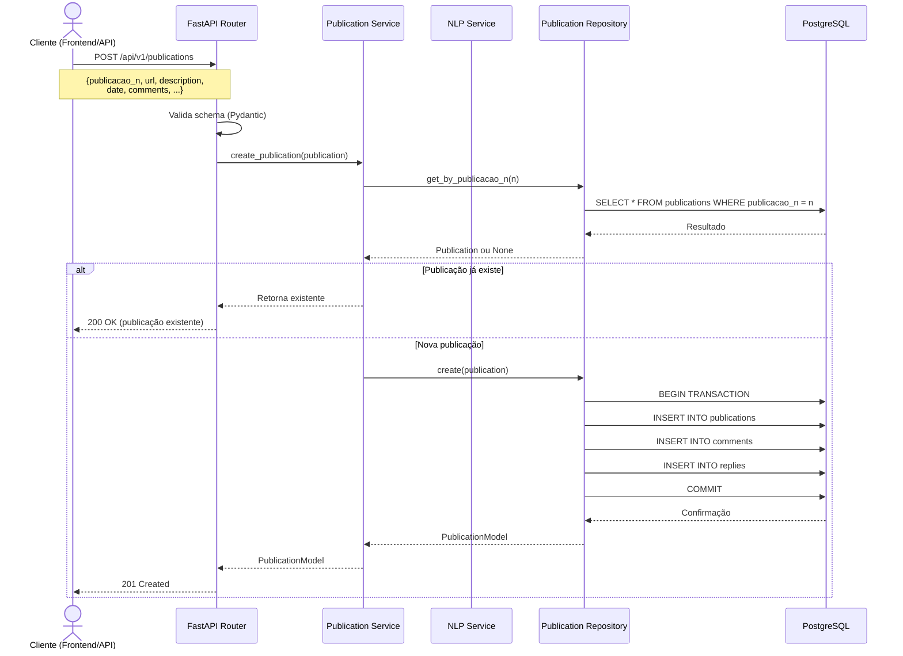

### 1.2. Importar Publicações de JSON

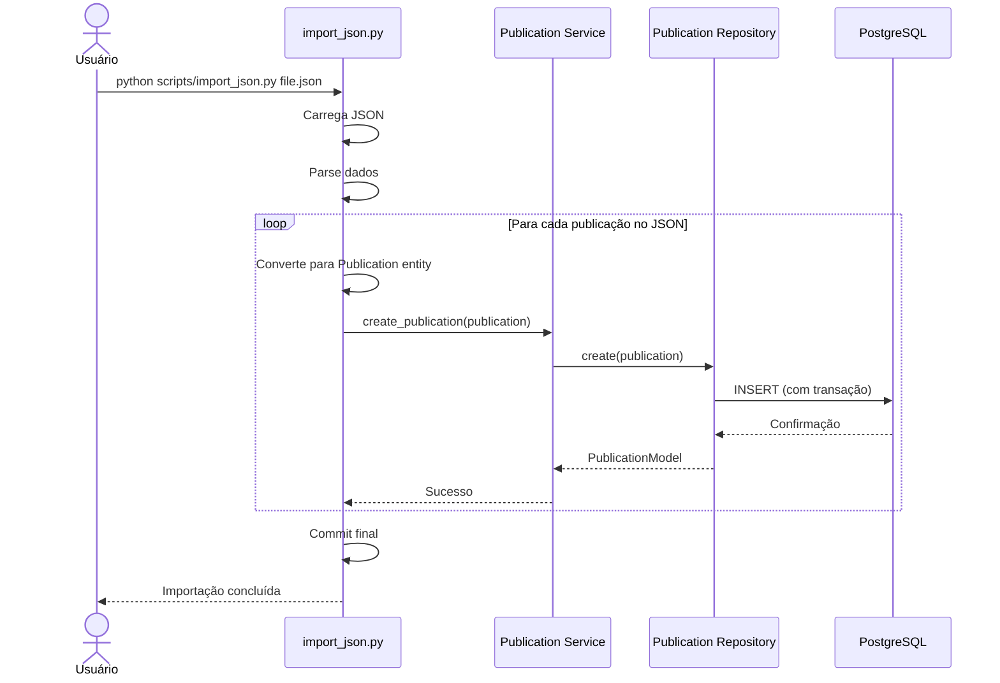

---

## 2. Fluxo de Listagem e Filtros

### 2.1. Listar Publicações com Filtros

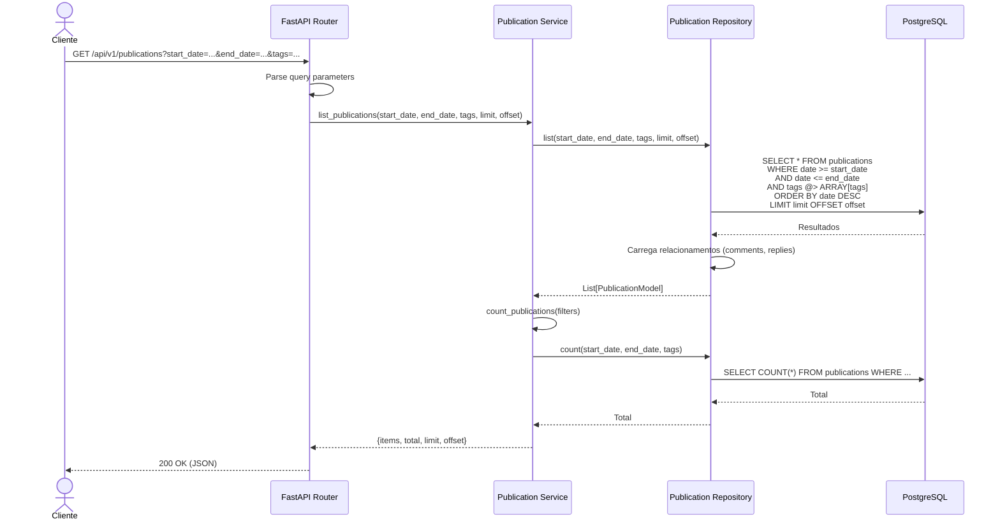

### 2.2. Buscar Publicações por Texto

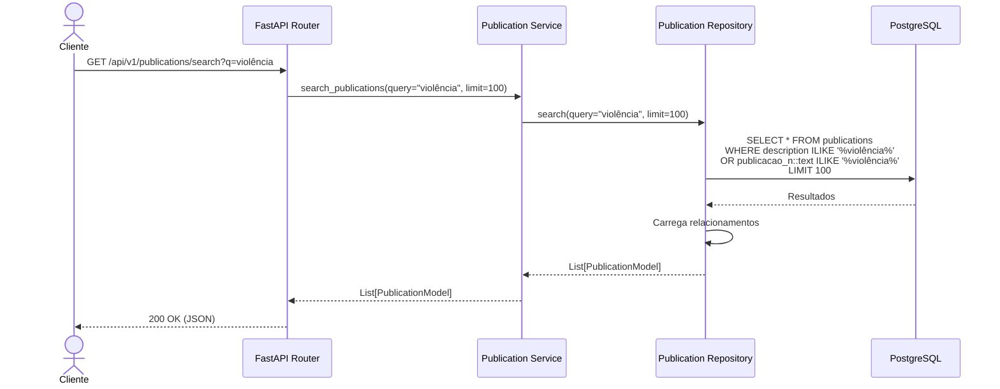

---

## 3. Fluxo de Análise NLP

### 3.1. Análise de Sentimento, Emoção e Tópico

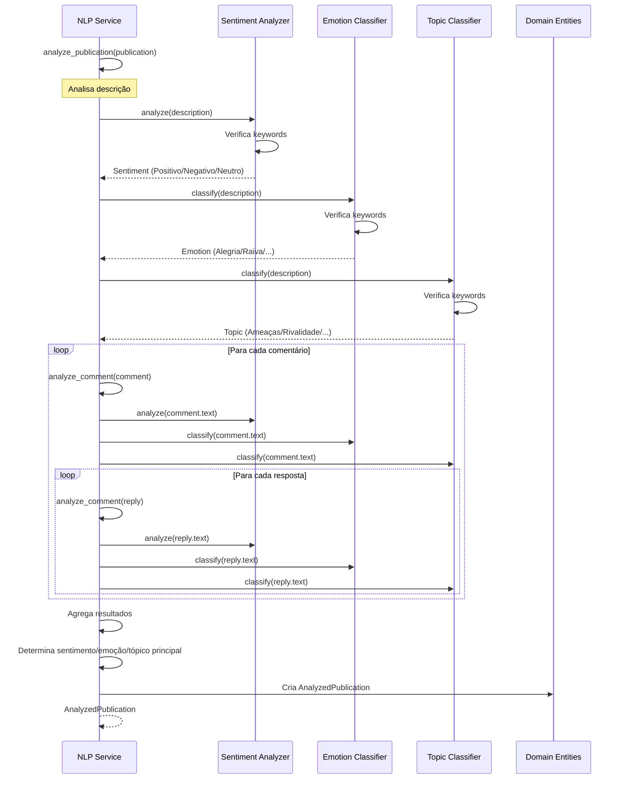

---

## 4. Fluxo de Dashboard e Estatísticas

### 4.1. Obter Estatísticas do Dashboard

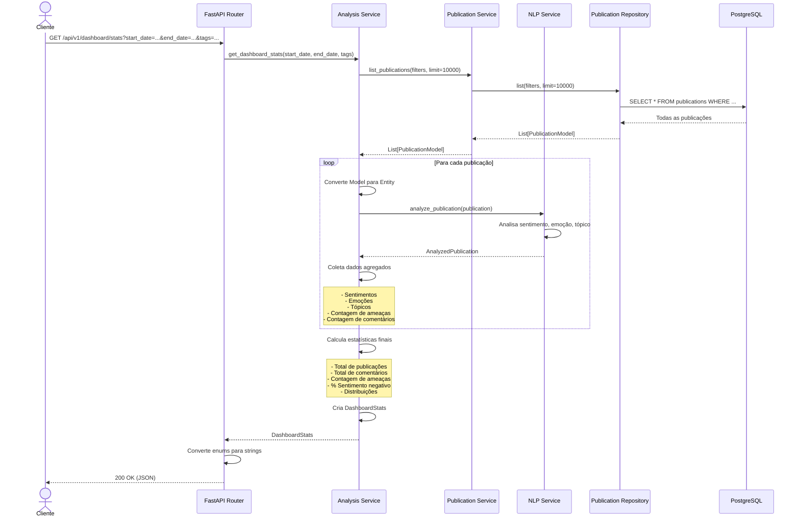

---

## 5. Fluxo de Cache (Futuro)

### 5.1. Consulta com Cache Redis

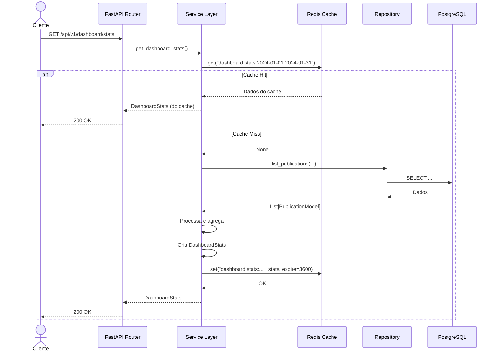

---

## 6. Fluxo de Autenticação (Futuro)

### 6.1. Login e Geração de Token

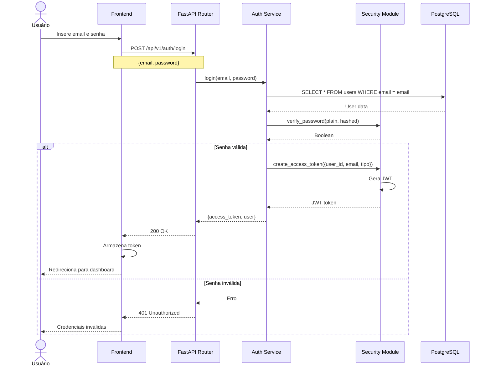

### 6.2. Requisição Autenticada

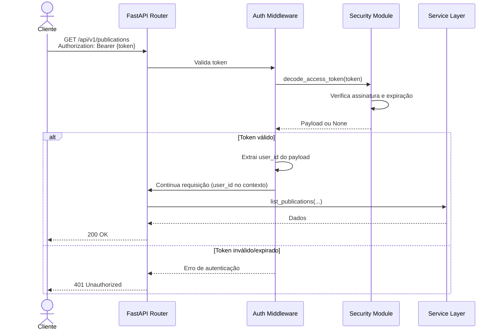

---

## 7. Fluxo de Análise de Segurança Pública com Drones

### 7.1. Análise de Stream de Drone em Tempo Real

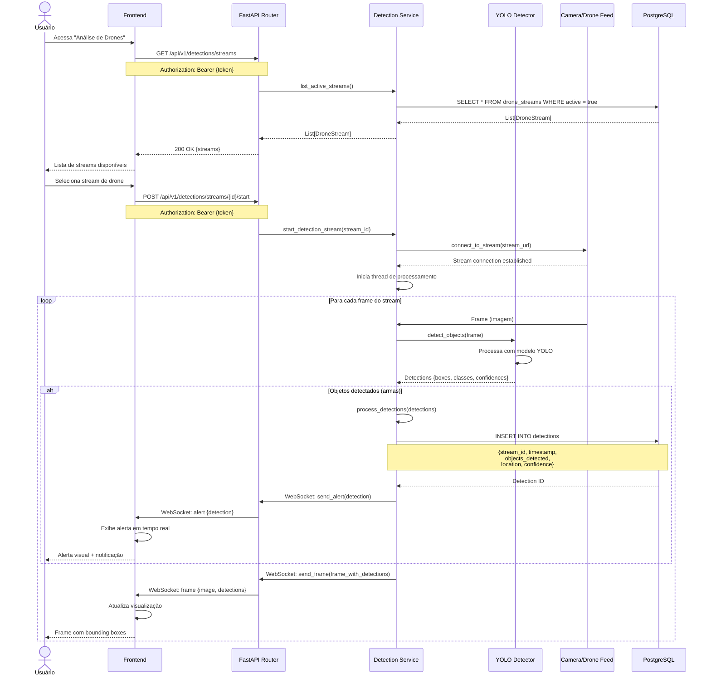

### 7.2. Upload e Análise de Imagem de Drone

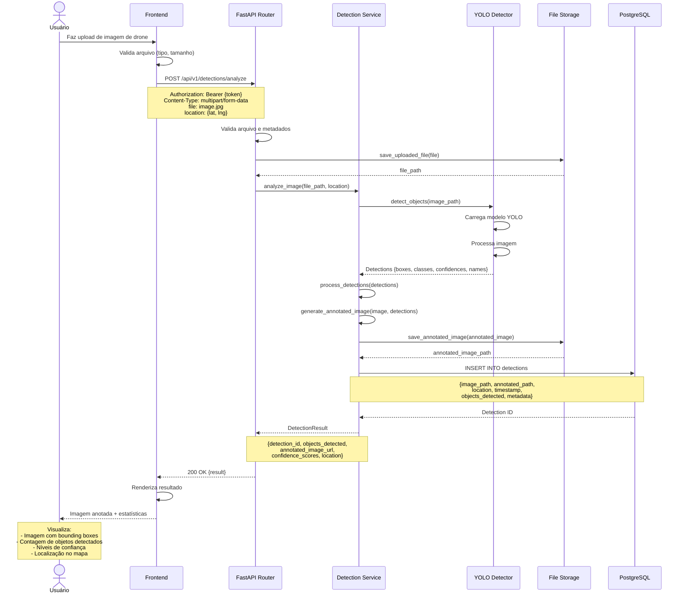

---

## 8. Fluxo de Dashboard Integrado

### 8.1. Dashboard Integrado com Alertas em Tempo Real

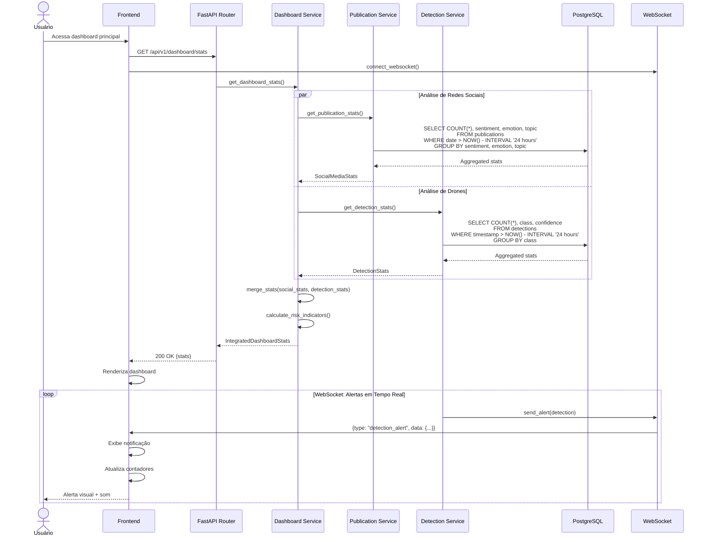

### 8.2. Visualização Integrada no Mapa

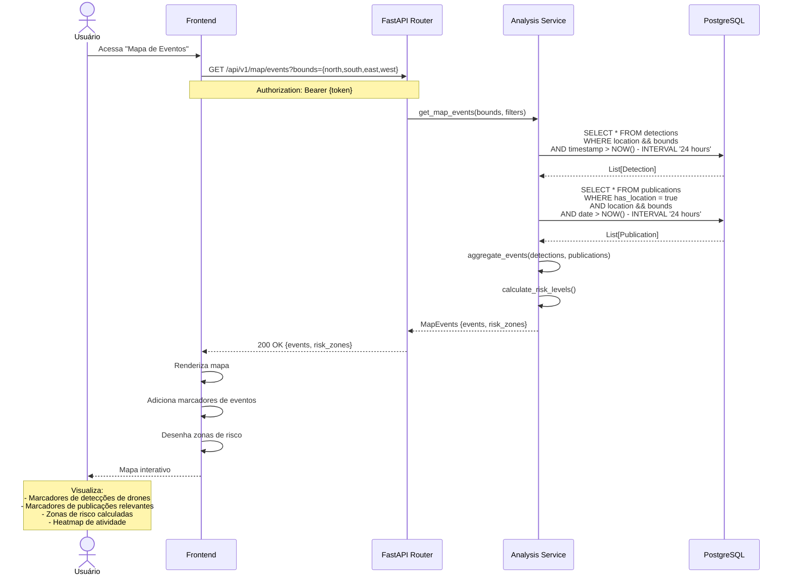

---

## Notas Técnicas

### Validação de Dados
- Todas as requisições são validadas por schemas Pydantic
- Erros de validação retornam 422 Unprocessable Entity

### Tratamento de Erros
- Exceções customizadas (NotFoundError, ValidationError, etc.)
- Logging de erros para debugging
- Mensagens de erro amigáveis para o cliente

### Performance
- Queries otimizadas com índices
- Eager loading de relacionamentos (selectinload)
- Cache Redis para queries frequentes (futuro)
- Paginação para listas grandes

### Transações
- Operações de escrita usam transações
- Rollback automático em caso de erro
- Commit explícito após sucesso

